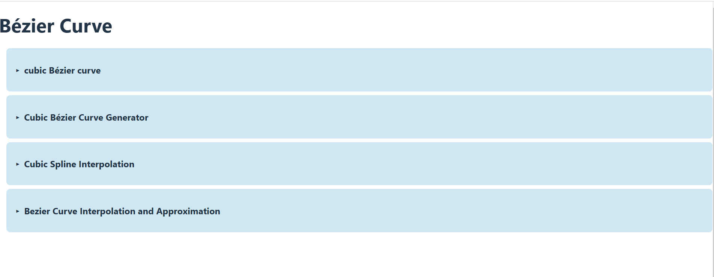

# Bézier Curve Visualizer
# bezcurveassigment



This repository contains the implementation of cubic Bézier curve interpolation and approximation.

## Features
- Interactive manipulation of control points
- Visualization of Bézier curves
- Responsive design


## Overview
The Bézier Curve Visualizer is a React application that allows users to interactively explore and manipulate Bézier curves and cubic spline interpolation. This project demonstrates the principles of curve generation and interpolation commonly used in computer graphics and geometric modeling.

## Features
- **Cubic Bézier Curve**: Users can manipulate a cubic Bézier curve by adjusting its control points in real-time.
- **Cubic Bézier Curve Generator**: Demonstrates cubic Bézier interpolation, constructing curves that pass through four specified points.
- **Cubic Spline Interpolation**: An interactive visualizer that showcases cubic spline interpolation and least squares approximation methods.

## Components
- **BezierCurve**: A component that allows users to create and manipulate a cubic Bézier curve.
- **InteractiveBezier**: A visualizer for cubic spline interpolation and least squares approximation.
- **CubicInterpolation**: A component that demonstrates cubic Bézier interpolation.

## Installation
To run this project locally, follow these steps:

1. Clone the repository:
   ```bash
     https://github.com/chebil-amel/bezcurveassigment.git

 ## Installation
   cd bezier-curve-visualizer
   npm install


   npm start#
